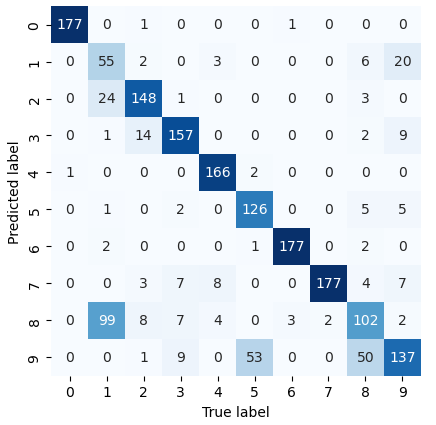
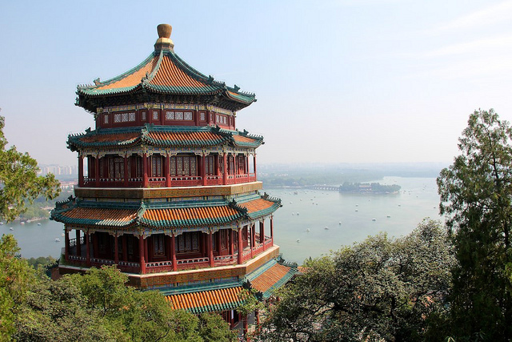
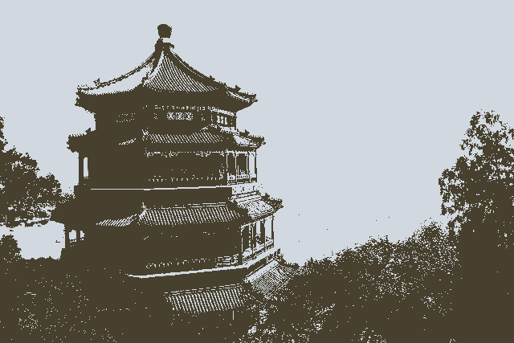
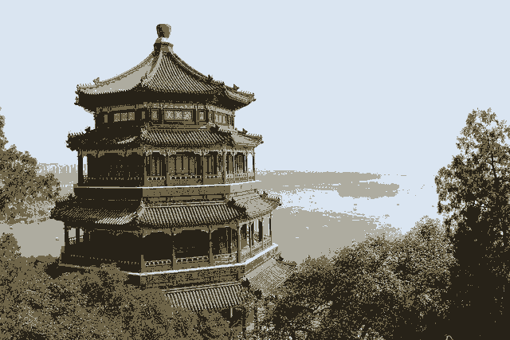
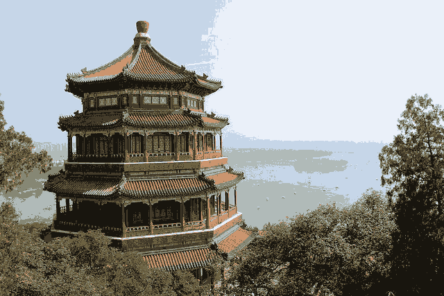
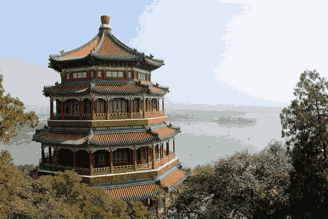
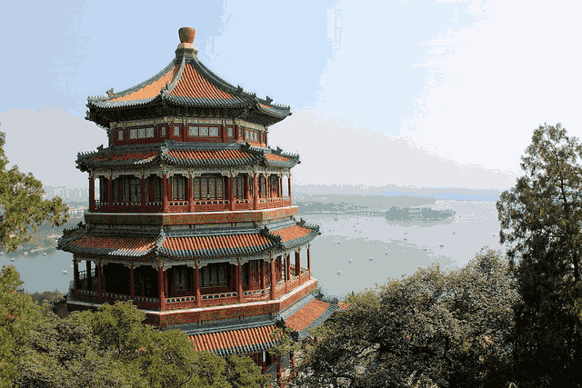
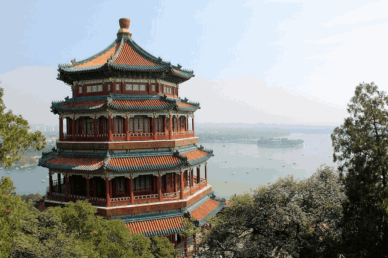

# K Means Clustering for Image Compression

The notebook was created using the notebook available at [05.11-K-Means PythonDataScienceHandbook](https://github.com/jakevdp/PythonDataScienceHandbook/blob/master/notebooks/05.11-K-Means.ipynb).

This repository contains a [Jupyter](https://jupyter.org/) Notebook for the training of a [K Means Clustering model](https://scikit-learn.org/stable/modules/clustering.html#k-means) for classifying different types of numbers and using it for colour compression.

### Libraries

- [Scikit Learn](https://scikit-learn.org/stable/) — Loading data, training model
- [Matplotlib Pyplot](https://matplotlib.org/stable/) — Visualising results
- [Numpy](https://numpy.org/) — Processing data

### Data

Two sets of data are used in this notebook.

1. The first is the `sklearn.datasets.load_digits` dataset which is a copy of the [UCI ML hand-written digits dataset](https://archive.ics.uci.edu/ml/datasets/Optical+Recognition+of+Handwritten+Digits). It contains 5620 8 by 8 pixel images of Arabic numeral digits. This data set is used for the classification.
2. The second is the `sklearn.datasets.load_sample_image(china.jpg)`, which is used for the colour compression. The other image that is available is `flower.jpg`. Both of these two images are 640 by 427  pixel images.

### Process

The following procedure is used in the Jupyter Notebook ([Ipynb](Notebooks/KMC_Compression.ipynb), [PDF](Notebooks/KMC_Compression.pdf)) to process and visualise the data:

1. The first section of the notebook is an exercise on content in the PythonDataScienceHandbook notebook. This section goes through the K Means Clustering model showing it visually how it works.
2. Next a K Means model is used to classify images of numbers. The results of this show that the model is not quite good at differentiating between the 1's and 8's.

   _Confusion Matrix for KMC model:_  
   

3. Finally the `china.jpg` image is loaded from Scikit-Learn.
4. The image is used to train a K Means Clustering model to take the 16 million colours in the image and compress it down to various smaller numbers.
5. The images are then saved and can be compared in quality, in file sizes and the file size in percentage relative to the original.

   _Original Image — Size 551KB:_  
   

   _2 Colour Image — Size 19KB => 3%:_  
   

   _4 Colour Image — Size 56KB => 10%:_  
   

   _8 Colour Image — Size 96KB => 17%:_  
   

   _16 Colour Image — Size 153KB => 28%:_  
   

   _32 Colour Image — Size 230KB => 42%:_  
   

   _64 Colour Image — Size 309KB => 56%:_  
   

   _128 Colour Image — Size 380KB => 69%:_  
   

   _256 Colour Image — Size 440KB => 80%:_  
   

   _512 Colour Image — Size 489KB => 89%:_  
   

   _1024 Colour Image — Size 522KB => 95%:_  
   
